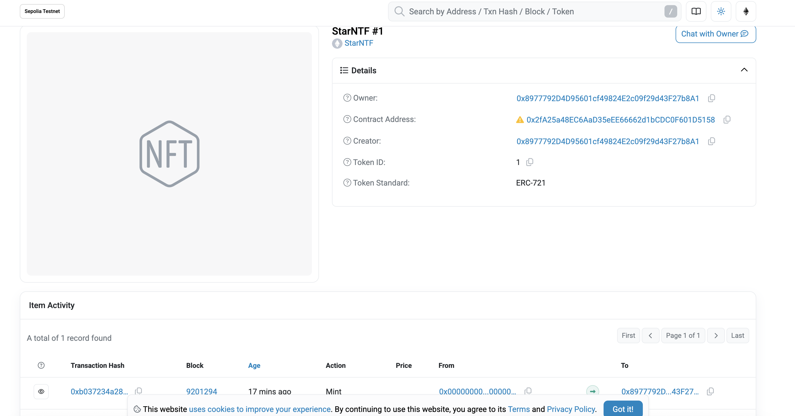
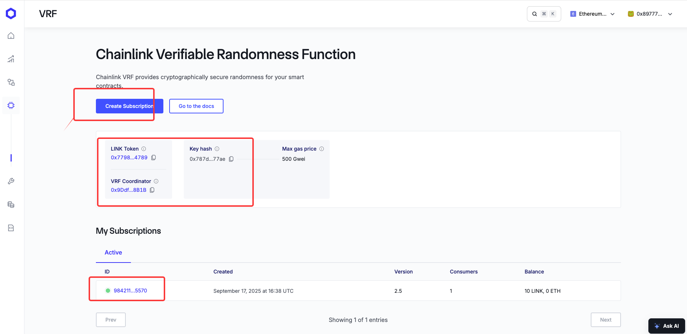
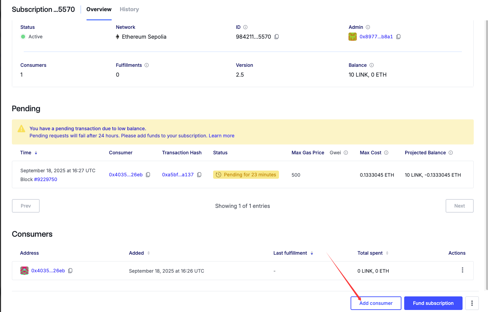
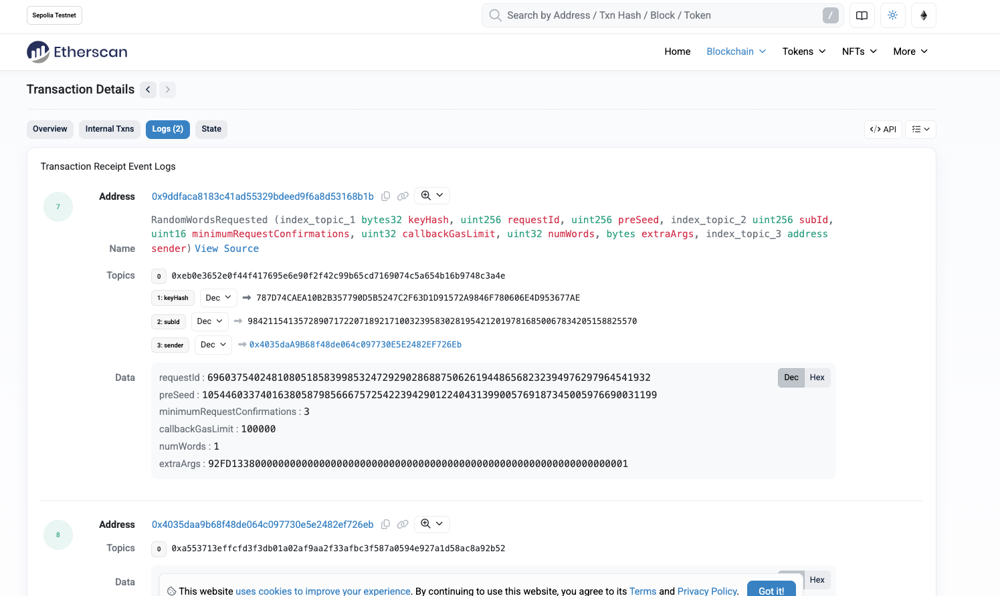
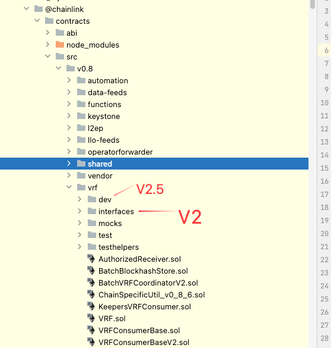

作业一：WaGaToken 代币
测试网合约地址：0xc7218177d3Ad806c1710EA6DfF5201eC9934BC77
.png)


作业二：StarNFT 合约
测试网合约地址：0x2fA25a48EC6AaD35eEE66662d1bCDC0F601D5158
继承ERC721协议实现NFT合约，实现铸造，体现等功能
.png)


作业三：讨饭合约
测试网合约地址：0x523fb9587708cebc87a99280c59b0a233f2a480e

Chainlink VRF随机数抽奖
1.到chain链接钱包，获取订阅ID  https://vrf.chain.link/   领取link测试网币：https://faucets.chain.link/



2. npm install @chainlink/contracts@1.4.0

3.实现获取订阅VRF随机数（注意这个要消费link代币，测试网络可领取）
3.1 导入(chainlink已经升级到2.5，与2.0获取方式有所不同)
```
import "@chainlink/contracts/src/v0.8/vrf/dev/VRFConsumerBaseV2Plus.sol";
import "@chainlink/contracts/src/v0.8/vrf/dev/libraries/VRFV2PlusClient.sol";
```
3.2 初始化
```
uint256 subscriptionId;//订阅ID
//测试协调器地址
    address vrfCoordinator;
    //代表使用哪个Gas Lane，不同价格的随机数
    bytes32 keyHash;
    //N个区块确认后再生成
    uint16 requestConfirmation =3;
    //回调gas费上限
    uint32 callbackGasLimit = 100000;
    //随机个数
    uint32 numWords= 1;
 constructor(address _coordinator, uint256 _subscriptionId, bytes32 _keyHash,uint256 _miniPrice) VRFConsumerBaseV2Plus(_coordinator) {
    vrfCoordinator = _coordinator;
    s_vrfCoordinator = IVRFCoordinatorV2Plus(_coordinator);
    subscriptionId=_subscriptionId;
    keyHash=_keyHash;
 }
```
3.3 发起请求获取随机数(2.5版订阅ID为uint256，原来为uint64 需要特备注意，新生成的必须使用2.5版本接口)
```
uint256 requestId = s_vrfCoordinator.requestRandomWords(
                    VRFV2PlusClient.RandomWordsRequest({
                        keyHash: keyHash,
                        subId: subscriptionId,
                        requestConfirmations: requestConfirmation,
                        callbackGasLimit: callbackGasLimit,
                        numWords: numWords,
                        extraArgs: VRFV2PlusClient._argsToBytes(
                            VRFV2PlusClient.ExtraArgsV1({nativePayment: true})
                        )
                    })
                );
```
3.4 随机数回调重写
```
function fulfillRandomWords(uint256 requestId, uint256[] calldata randomWords) internal override {
    uint256 randomness = randomWords[0];
    //这里以抽奖为例，参与抽奖人地址
    uint256 winnerIndex = randomness % joinAddress.length;
    address winner = joinAddress[winnerIndex];
    //其他业务....
}
```
4.部署合约到sepolia网络（remix本地网络无法获取）
4.1 从chainlink获取到的订阅ID ，协调器id,hask_key 填写到合约部署几个参数
4.2 部署成功后，将合约地址添加到 chainkey控制台的消费者中

4.3 执行合约drawWinner方法发起获取，获取成功后自动回调，合约调用测试网可查记录


5.注意点
```
V2.5版本与2.0接口在不同包，实现方式所有不一样，且2.5目前暂时无支持UUPS更新的pkg。 目前chainlink暂时没有入口创建版本2的订阅ID


```